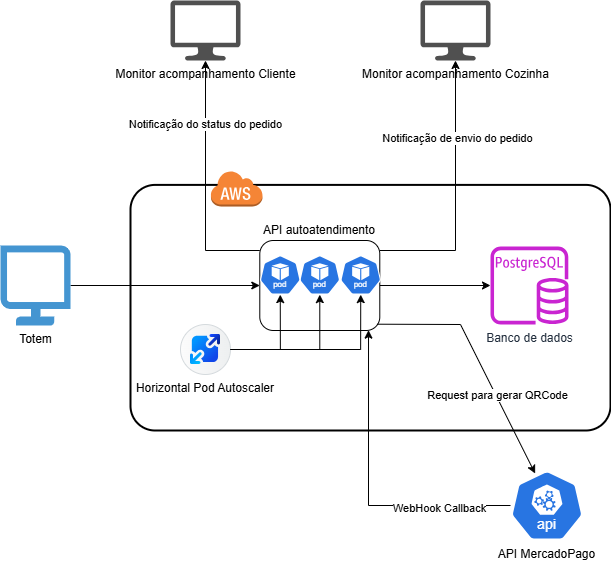

# Autoatendimento Fast Food - FIAP Challenge

API backend desenvolvida com **FastAPI**, utilizando os princípios de **Clean Architecture** e **Clean Code**, para simular um sistema de autoatendimento de fast food. Esta é a Fase 2 do Tech Challenge da FIAP.

---

## 🚀 Tecnologias Utilizadas

- Python 3.11+
- FastAPI
- SQLAlchemy (async)
- PostgreSQL
- Docker & Docker Compose
- Uvicorn
- Pydantic
- Mercado Pago SDK
- Ngrok (para testes de Webhook)

---

## 🧱 Arquitetura do Projeto

A estrutura segue os princípios de **Clean Architecture**, com camadas bem definidas:

```
app/
├── api/                         # Rotas da API (FastAPI)
├── application/                 # Use Cases (casos de uso)
├── domain/                      # Entidades de domínio + Value Objects                 
├── infrastructure/              # Banco de dados, serviços externos, implementações concretas
│   ├── db/                      # Repositórios, models, dependências
│   └── external/                # Integrações (ex: Mercado Pago)
├── schemas/                     # Schemas Pydantic para validação e serialização de dados (entrada/saída da API)
main.py                          # Ponto de entrada da aplicação
```
---
## 🧱 Desenho da arquitetura

---

## 📋 Funcionalidades

### Fase 1
- Cadastro e listagem de clientes
- Cadastro, listagem e busca de produtos por categoria
- Criação de pedidos com ou sem cliente
- Atualização do status (`Recebido`, `Em preparação`, `Pronto`, `Finalizado`)
- Listagem dos pedidos em andamento
- Fila de pedidos por ordem de criação
- Integração com banco de dados PostgreSQL

### Fase 2
- [x] **Checkout de Pedido**: criação do pedido com retorno do ID
- [x] **Listagem com ordenação personalizada**: `Pronto > Em preparação > Recebido`, e antigos antes dos novos
- [x] **Atualização de status do pedido**
- [x] **Consultar status de pagamento**
- [x] **Integração com Mercado Pago**:
  - Geração de QR Code para pagamento
  - Webhook de retorno para confirmação (aprovado ou recusado)
- [x] **Filtro de pedidos por status**

---

## 📬 Principais Rotas

| Método | Rota                             | Descrição |
|--------|----------------------------------|-----------|
| POST   | `/clientes`                      | Criação de cliente |
| POST   | `/produtos`                      | Cadastro de produto |
| GET    | `/produtos/categorias/{categoria}` | Listar produtos por categoria |
| POST   | `/pedidos`                       | Checkout (criação) de pedido |
| GET    | `/pedidos`                       | Lista pedidos com ordenação e filtros (exclui finalizados) |
| GET    | `/pedidos/por-status?status=X`   | Lista pedidos por status |
| PUT    | `/pedidos/{id}`                  | Atualiza status do pedido |
| POST   | `/pedidos/{id}/pagar`            | Gera QR Code para pagamento |
| POST   | `/webhook`                       | Webhook para Mercado Pago |

---

## ⚙️ Como Executar Localmente

### 1. Com Docker (em breve)

```bash
docker-compose up --build
```

### 2. Manualmente

#### 1. Pré-requisitos
- Python 3.11+
- PostgreSQL rodando localmente
- [Ngrok](https://ngrok.com/) instalado (para testes de Webhook)

#### 2. Instalar dependências

```bash
python -m venv venv
source venv/bin/activate  # Windows: venv\Scripts\activate
pip install -r requirements.txt
```

### 3. Rodar o servidor

```bash
uvicorn app.main:app --reload
```

---

## 💳 Integração com Mercado Pago (QRCode e Webhook)

## 3. Deployment
```bash
    kubectl apply -f deployment.yaml   
    kubectl apply -f deployment-postgresql.yaml 
 ```

## 📬 Rotas principais

### 1. Configurar variáveis de ambiente

Crie um arquivo `.env` na raiz do projeto com:

```env
MERCADO_PAGO_ACCESS_TOKEN=seu_token_aqui
MERCADO_PAGO_WEBHOOK_URL=https://<seu_ngrok>.ngrok-free.app/pagamento/webhook
```

> ⚠️ **Importante:** sempre que reiniciar o ngrok, a URL muda, então atualize o `MERCADO_PAGO_WEBHOOK_URL` no `.env`.

---

### 2. Rodar ngrok

```bash
ngrok http 8000
```

Copie a URL gerada (ex: `https://1234-00-00-00-00.ngrok.io`) e atualize a variável `MERCADO_PAGO_WEBHOOK_URL`.

---

## 🧪 Testes

(Testes automatizados serão adicionados em breve usando `pytest` e `httpx`.)

---

## 📌 Observações

Este projeto faz parte da pós-graduação em Arquitetura de Software da FIAP, como entrega prática da Fase 2 do Challenge. Foco em boas práticas, SOLID, Clean Code e integração com serviços reais (como Mercado Pago).

---

## ✍️ Autor

Felipe Nascimento - [@fegusta](https://github.com/fegusta)
